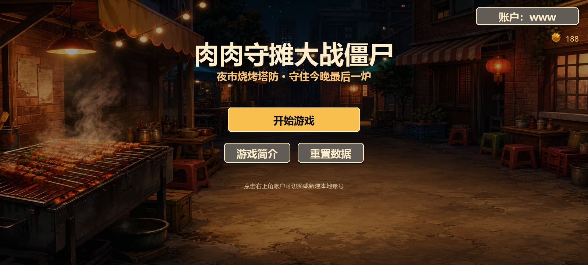
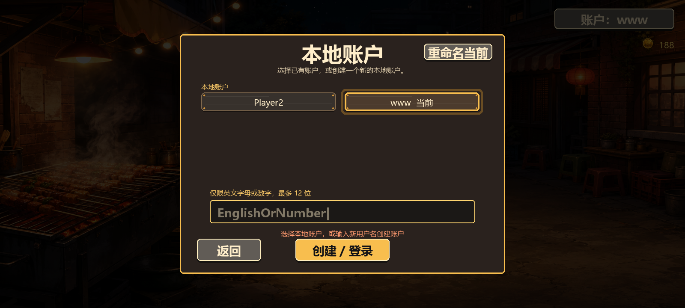
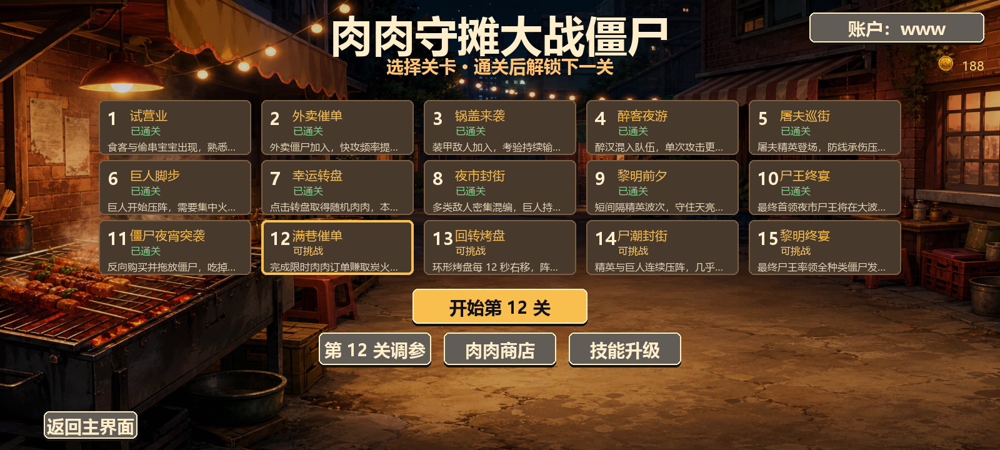
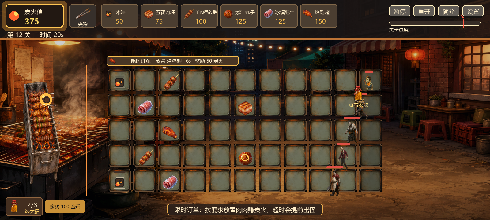
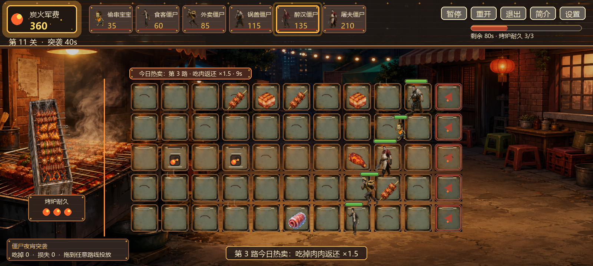
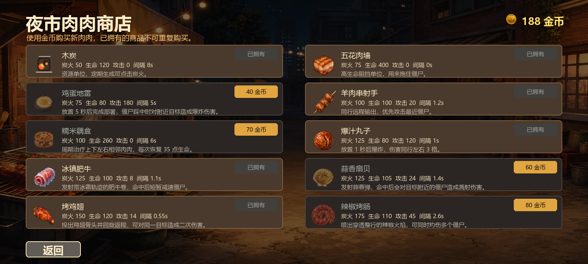
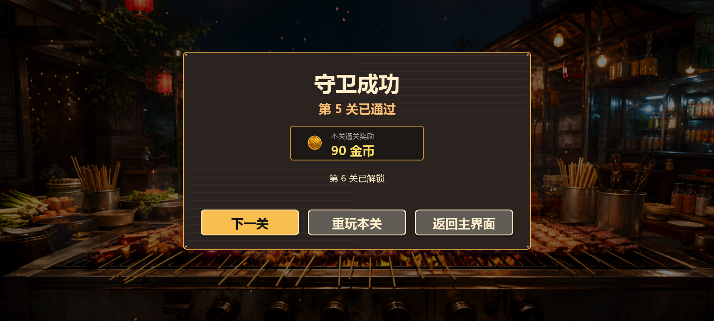

# 肉肉守摊大战僵尸

一款使用 **Python + Pygame** 制作的原创夜市烧烤主题格子塔防游戏。玩家需要收集炭火、部署肉肉守卫、搭配油瓶大招，在十五个逐步升级的关卡中守住深夜烧烤摊。

项目目前处于可完整游玩的 MVP 阶段，包含本地账户、关卡进度、金币商店、永久升级、六单位编队、独立关卡调参、背景音乐和四种特殊关卡机制。

## 在线试玩

**Vercel：<https://rou-rou-night-market-defense.vercel.app>**

首次打开需要等待游戏资源加载，然后点击页面启动。网页版账户与进度保存在当前浏览器本地，不会上传到服务器，也不会自动同步到其他设备或浏览器。

## 游戏截图

### 简洁主界面



### 本地账户选择



### 十五关关卡选择



### 限时订单战斗



### 僵尸夜宵突袭



### 肉肉商店



### 守卫成功结算



## 玩法特色

- **夜市烧烤主题**：烤盘战场、真实食物风格肉肉、烧烤架资源点与夜市僵尸。
- **十五个顺序关卡**：普通波次、幸运转盘、限时订单、回转烤盘和双首领终局。
- **十种肉肉守卫**：远程、阻挡、爆炸、减速、治疗、穿透和资源生产各有定位。
- **八种主题僵尸**：从偷串宝宝、外卖僵尸到巨人和夜市尸王逐步登场。
- **油瓶大招**：每种肉肉都有不同的大招效果，可在局内逆转高压战况。
- **成长与编队**：金币购买新肉肉、永久升级属性，每关选择最多六个单位出战。
- **本地持久化**：账户、关卡、金币、购买、升级、编队与调参自动保存在本地。
- **便于平衡调试**：每关拥有独立资源、肉肉和僵尸参数，不会污染其他关卡。

## 快速开始

需要 Python 3.10 或更高版本。

```powershell
git clone https://github.com/18888749379-svg/rou-rou-night-market-defense.git
cd rou-rou-night-market-defense
python -m venv .venv
.\.venv\Scripts\Activate.ps1
python -m pip install -r requirements.txt
python src/main.py
```

Windows 用户也可以在安装依赖后双击：

```powershell
.\run_game.bat
```

macOS / Linux：

```bash
python3 -m venv .venv
source .venv/bin/activate
python -m pip install -r requirements.txt
python src/main.py
```

运行发布前冒烟测试：

```powershell
python scripts/smoke_test.py
```

## 操作

- 鼠标点击上方卡片选择单位，再点击格子放置。
- 点击烧烤架或战场上出现的炭火球获得炭火值，太久不点会消失。
- `1-6`：按顶部卡片顺序选择本关编队中的肉肉
- `P`：暂停/继续
- `R`：重新开始本局
- `Esc`：取消当前操作；再次按下会打开退出本关确认
- `I`：打开/关闭游戏简介
- `T`：打开/关闭调参面板
- 鼠标右键：取消当前肉肉、烧烤夹或油瓶大招选择
- 第11关可点击僵尸卡后点击路线，也可直接把僵尸拖到任意路线投放

## MVP 内容

- 5 x 11 战场，前 10 列可放置，僵尸从最后一个烤盘右侧进入。
- 炭火值初始 100，不再自动固定增长。
- 烧烤架和木炭生成的炭火需要点击收集。
- 木炭放置满 60 秒后进入旺火状态，每个产出周期会同时生成两个 25 点炭火。
- 击败僵尸的炭火奖励会自动收集。
- 基础单位：羊肉串射手、五花肉墙、爆汁丸子、木炭、烤鸡翅、冰镇肥牛。
- 商店单位：鸡蛋地雷、蒜香扇贝、辣椒烤肠、糯米藕盒。
- 鸡蛋地雷部署 5 秒后踩踏爆炸；蒜香扇贝发射溅射蒜瓣弹；辣椒烤肠喷出整行穿透火焰；糯米藕盒治疗相邻单位。
- 羊肉串射手发射羊肉块；烤鸡翅发射回旋鸡翅骨头；冰镇肥牛发射冰冻肥牛片并减速；爆汁丸子裂开后汁水爆炸。
- 敌人：食客、偷串宝宝、外卖、锅盖、醉汉、屠夫、大巨人和最终首领夜市尸王，共 8 类。
- 包含 15 个顺序解锁关卡；已通关关卡可以重复挑战，第 10 关为尸王初战，第 15 关为最终尸王战。
- 每关开始前从已拥有单位中选择最多 6 个出战；胜利界面可直接进入下一关。
- 第 7 关为幸运转盘特殊关：点击左侧转盘取得随机肉肉，本关不使用炭火。
- 第 11 关为僵尸夜宵突袭：系统自动部署肉肉，玩家购买并拖放僵尸，吃肉返还炭火，三次突破烤炉获胜。
- 第 12 关为满巷催单特殊关：周期出现限时肉肉订单，按要求放置可获得炭火；超时会让下一波提前到场。
- 第 13 关为回转烤盘特殊关：环形烤盘每 12 秒右移一格，最右侧肉肉会回到最左侧。
- 波次密度和高级僵尸比例逐关提高，每关至少包含两类僵尸，后期关卡先出现低级敌人再出现精英。
- 开局前 8 秒不会出现僵尸，留给玩家发育。
- 全部波次出现并击败所有僵尸后胜利。
- 战场方格使用烤盘/餐盘风格，肉肉和僵尸都在烤盘上行动。
- 开局和每次成功放置后不会预选单位，避免误触重复放置。
- 每种肉肉拥有独立放置冷却：木炭为 3 秒，攻击与辅助单位为 5-8 秒，五花肉墙为 15 秒；顶部卡片会显示剩余倒计时。
- 鸡蛋地雷部署前只有 1 点生命，5 秒后恢复完整生命并进入触发状态；僵尸踩中后只爆炸一次并自动消失。
- 点击顶部烧烤夹后再点击肉肉，可以把它从烤盘上夹走。
- 游戏中可点击顶部 `退出`，经二次确认后直接返回主界面，不会误判失败或发放通关奖励。
- 通关或失守会先播放烧烤摊胜负过场，再显示本关金币、重玩、下一关和返回主界面选项。
- 每关会由指定击败序号的僵尸掉落油瓶：前 4 关 1 个，其余关卡 2 个。点击收取后可在底部选择油瓶，再点击已放置肉肉释放专属大招。
- 局内可花费 100 金币购买油瓶；油瓶每关清零，默认容量 3，可在技能页永久升级至 6。

### 油瓶大招

- 木炭：立即生成 3 份当前单次产量的炭火。
- 羊肉串射手：5 秒内高速发射羊肉块。
- 五花肉墙：模型立即变大，最大生命与当前生命翻倍。
- 鸡蛋地雷：在随机空烤盘部署一个新的鸡蛋地雷。
- 糯米藕盒：永久把该单位的治疗范围从 1 格扩大至 2 格。
- 爆汁丸子：该丸子爆炸时的伤害翻倍。
- 冰镇肥牛：立即减速本行全部僵尸，并在 5 秒内高速发射肥牛片。
- 蒜香扇贝：向上抛出最多 6 份扇贝，随机砸向全场僵尸。
- 烤鸡翅：7 秒内发出的鸡骨头会飞至最后一个烤盘再回旋。
- 辣椒烤肠：让整条路持续燃烧 4 秒，对本行现有及新进入的僵尸持续造成伤害。
- 主菜单与战斗使用不同背景音乐；声音设置可控制音乐、总音效和各类特殊音效音量。

## 调参面板

主菜单先选择关卡，再点击对应的 `第 N 关调参`；游戏右上角也有当前关卡的设置入口。面板分为：

- `资源`：初始炭火值、烧烤架生成间隔、烧烤架生成量、木炭生成量、炭火消失时间。
- `肉肉`：所需炭火、生命值、攻击力、攻速/产出间隔。
- `僵尸`：生命值、移速、攻击力、攻击间隔、击败奖励炭火。
- `声音`：背景音乐开关与音量、音效开关与总音量、各肉肉攻击、僵尸出现和最终波警报音量。

资源、肉肉和僵尸参数按关卡独立保存，不会改变其他关卡；声音设置对所有关卡生效。大多数参数会立即影响当前关卡的后续行为，`初始炭火值` 在重开本局后生效。

## 本地存档

游戏会在项目根目录自动创建 `save_data.json`，保存以下内容：

- 支持多个本地玩家名账户，不需要密码或网络。
- 首次进入必须输入用户名；用户名仅支持英文字母和数字，最长 12 位。
- 点击右上角账户入口可以切换已有本地账户、新建账户或重命名当前账户。
- 每个账户独立保存金币、已解锁关卡、已通关关卡和最近选择的关卡。
- 每个账户独立保存已购买肉肉、三阶段技能升级和最近编队。
- 每个账户独立保存油瓶容量升级，局内油瓶数量不跨关卡保存。
- 资源、肉肉、僵尸的全部调参值。
- 背景音乐、音效开关和各项音量。

每次成功写入新存档前会保留上一份有效数据到 `save_data.json.bak`。如果主存档损坏，游戏会自动尝试读取备份。

桌面版存档位于项目目录；网页版使用浏览器 `localStorage`。从 GitHub 克隆或下载的项目不包含任何玩家存档，其他玩家首次运行会从零开始。

完成关卡会获得金币，击败僵尸也有 10% 概率掉落需要点击领取的金币。调参、购买、升级、领取金币和完成关卡都会立即写入存档。主菜单的 `重置数据` 需要连续确认两次，会清除所有账户、进度和调参。

## 参考

- pygame 官方文档：https://www.pygame.org/docs/
- 用户提供的 pygame 植物大战僵尸教程：https://segmentfault.com/a/1190000019418065

## 项目结构

```text
assets/                 图片、音乐、音效与来源说明
docs/screenshots/       GitHub 项目截图
scripts/                资源生成、截图和冒烟测试工具
scripts/build_web.py    生成 Pygbag 网页版
scripts/prepare_vercel_output.py  准备 Vercel 静态预构建输出
src/assets.py           图片、字体与音频加载
src/entities.py         肉肉、僵尸、投射物和特效
src/game.py             游戏状态、界面、关卡和存档流程
src/save_data.py        原子写入与备份恢复
src/settings.py         单位、敌人、关卡和默认数值
```

## 许可证与声明

项目代码使用 [MIT License](LICENSE)。第三方音频不适用 MIT License，具体作者、来源和授权信息请查看 [assets/audio/CREDITS.md](assets/audio/CREDITS.md)。AI 生成图片的制作说明见 [assets/images/GENERATED_ASSETS.md](assets/images/GENERATED_ASSETS.md)。

本项目是独立制作的原创主题学习项目，与 PopCap、Electronic Arts 或《植物大战僵尸》官方无关；仓库未使用《植物大战僵尸》的原始图片、音乐或代码。
